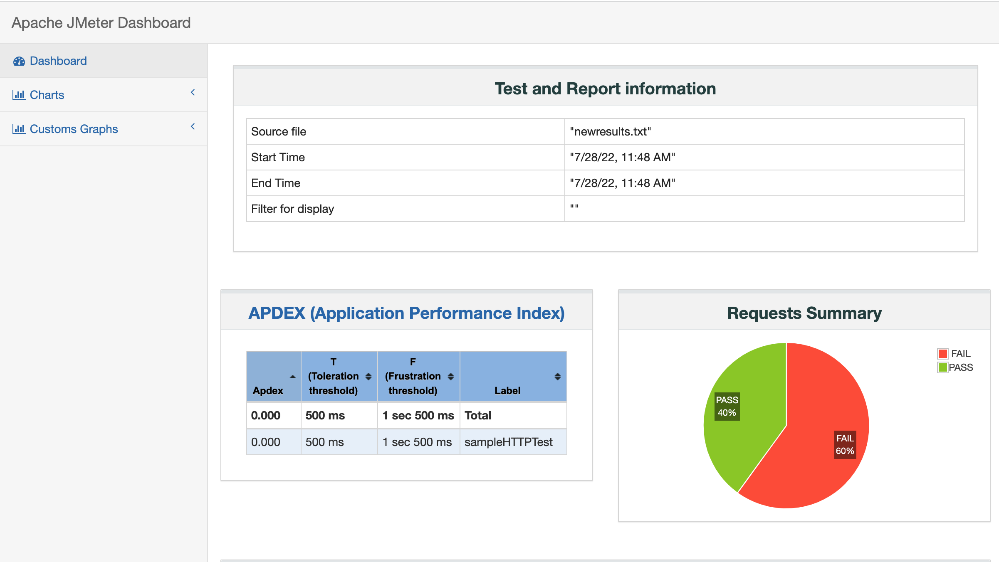
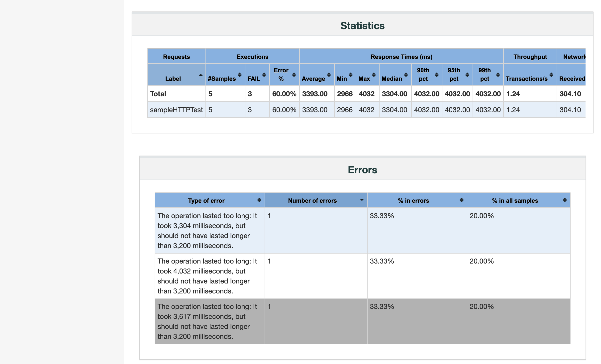
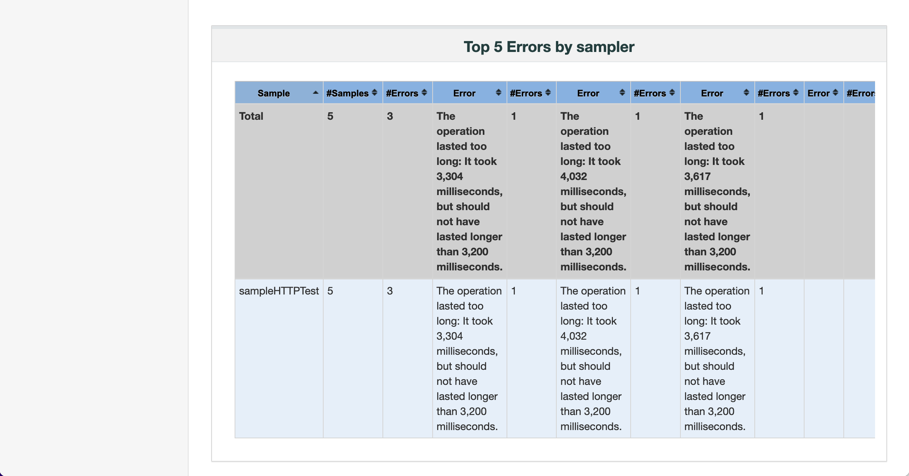
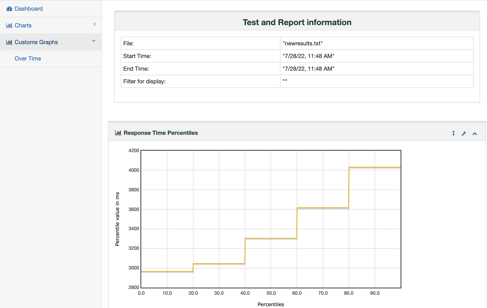
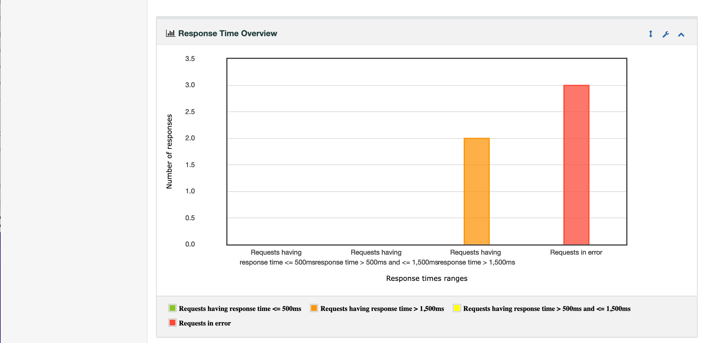
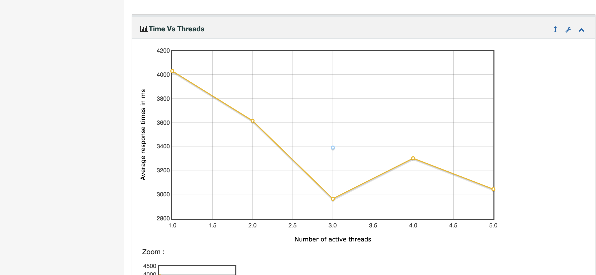

# Performance Testing JMeter

This is a simple project to test response time github.com 

Set 2 assertions 
* Based on duration less tan 3.2 seconds
* HTML response

To run the script from command line 

`jmeter -n -t com.dumm-web-test-example.jmx -l newresults.txt -e -o newreports1`

this will generate test report as shown 

More explanation when this project is propery implemented.